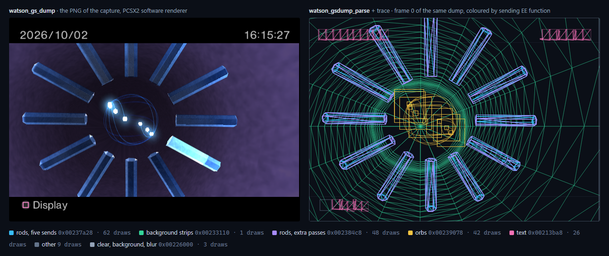
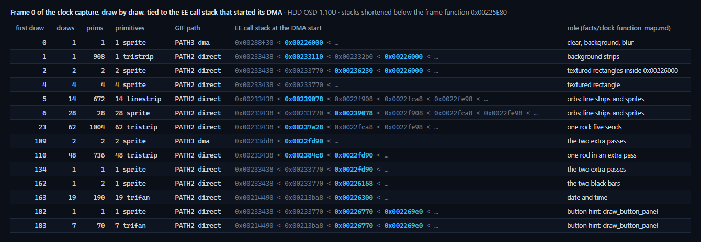
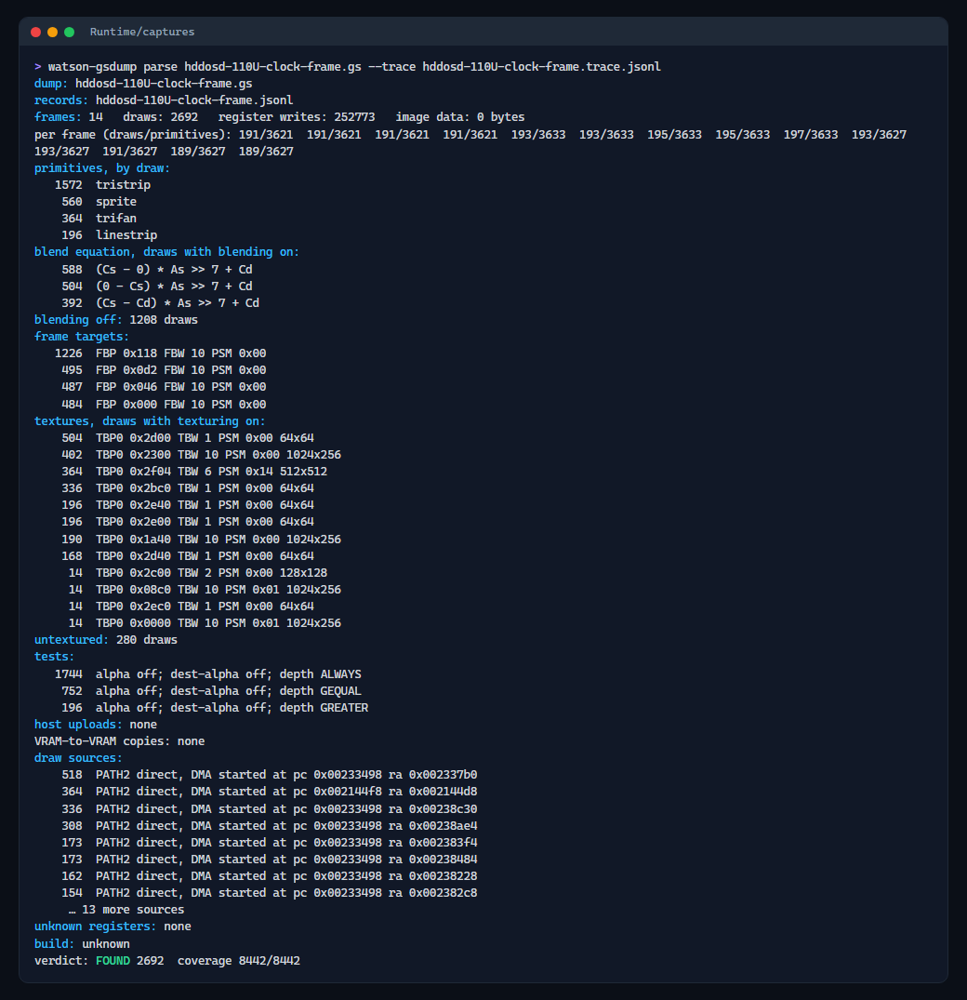
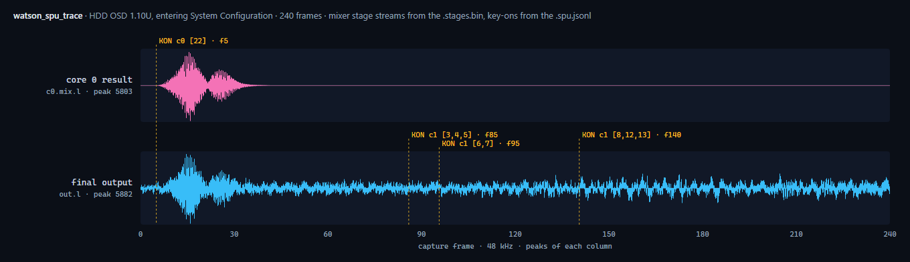
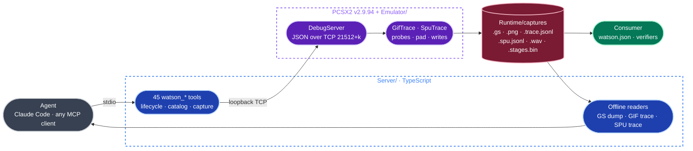

<p align="center">
  
  <h1 align="center">Watson</h1>
  <p align="center">
    <strong>An instrumented PCSX2 and an MCP server: a live PS2 that an agent drives, probes and records, frame by frame.</strong>
  </p>
  <p align="center">
    
    
    
    
    
    
  </p>
</p>

---

Watson is the live witness for PS2 reverse engineering. It is a fork of
[hkmodd/PCSX2-MCP](https://github.com/hkmodd/PCSX2-MCP) built against PCSX2 **v2.9.94**: a debug server
and a set of hooks compiled into the emulator, and a TypeScript MCP server that exposes them as `watson_*`
tools. An agent launches the emulator, reaches a screen with the pad, saves it under a name, and records
what the machine did there: the EE registers and memory at any instruction, every packet sent to the GS
with the EE code that sent it, the GS memory between draws, every SPU2 register write and the mixed sound,
sample by sample.

Watson has no window of its own: everything it adds lives inside PCSX2 and answers over a socket. Its
output is files, and a file is returned only once it is closed and complete. The first consumer is
[CrystalClockVK](https://github.com/JeanxPereira/CrystalClockVK), which turns those recordings into
verified facts about the PlayStation 2 OSD.

## What it captures

<p align="center">
  
</p>
<p align="center">
  <sub>The HDD OSD 1.10U clock screen. Left: the PNG <code>watson_gs_dump</code> writes beside the dump, from PCSX2's software renderer. Right: frame 0 of the same dump parsed by <code>watson_gsdump_parse</code> with its GIF trace, every primitive of its 191 draws drawn as a wireframe and coloured by the EE function that sent it</sub>
</p>

<p align="center">
  
</p>
<p align="center">
  <sub>The same frame as a draw list: each group of draws, its GIF path, and the EE call stack recorded at the instruction that started its DMA. The roles come from CrystalClockVK's function map</sub>
</p>

<p align="center">
  
</p>
<p align="center">
  <sub>The summary of that capture from the offline parser (the CLI twin of <code>watson_gsdump_parse</code>): 14 frames, 2 692 draws, 8 442 of 8 442 packets read, ending in its verdict line. The draw sources are cut after 8 rows</sub>
</p>

<p align="center">
  
</p>
<p align="center">
  <sub><code>watson_spu_trace</code> over 240 frames of entering System Configuration on HDD OSD 1.10U: core 0's result and the final output from the per-stage stream, and the key-on writes from the trace, each placed at the first output sample it can change</sub>
</p>

<p align="center">
  
</p>
<p align="center">
  <sub>What the measurements enable: CrystalClockVK's Vulkan GS parity renderer, built from facts measured with Watson, beside PCSX2's software renderer on the same frame, and their difference</sub>
</p>

## Features

| Area | What it does |
|---|---|
| EE probes | Up to 1 024 program counters per capture. At each one, before the instruction runs: the 32 general registers, the 32 FPU registers and up to 64 memory ranges (`a0:0x160`, `*a1+0x60:0x40`), in order with the GS packets. A probe can be limited to a window of capture frames |
| GIF trace | Every packet the EE side hands to the GIF on PATH1, PATH2 and PATH3, with its source address, the channel registers, and the EE `pc`, `ra`, `sp` and call stack that started its DMA. Checked byte for byte against a GS dump of the same frames before the tool answers |
| GS dumps | Uncompressed `.gs` dumps of N frames with a PNG beside them, parsed offline into JSON Lines: every draw with its primitive, vertices and register state, every upload and VRAM copy, and, given a trace, the EE origin of each draw |
| GS memory | The 4 MB of GS local memory, or a part, written to a file after the GS thread has drawn everything sent so far |
| Time and input | Exactly N frames, then pause; pad presses held for N frames; inside a capture, a pad schedule and EE memory writes applied on exact frame boundaries and recorded in the trace |
| States | Save states by file, or by name per build from the consumer's `watson.json`, so a session starts with `watson_launch {build, state}` |
| Sound | Every SPU2 register write, timed to the first output sample it can change; every DMA4/DMA7 start and every copy into SPU2 RAM; the mixed output as a WAV and every mixer stage per sample; the SPU2 RAM, the register mirror and the 24 voices of both cores as files |
| IOP | IOP probes (32 GPRs, `hi`, `lo`, memory ranges) under the IOP interpreter or recompiler; IOP memory reads; IOP modules with their text addresses |
| Debugger | The inherited EE debugger: registers up to 128 bits, PCSX2's own disassembler, expressions, conditional breakpoints, watchpoints, step and step over, backtraces, threads |
| Instances | Up to 8 emulators side by side, instance *k* on debug port `21512+k` and Pine port `28011+k`, each with its own data directory |
| Isolation | Its own PCSX2 data in `Runtime/`, never `Documents/PCSX2`; the emulator starts minimized without taking the focus; a server kills only the emulator it launched |

## How it works



| Unit | Path | Role |
|---|---|---|
| Emulator patch | `Emulator/` | `DebugServer.cpp` (the command server inside PCSX2), `GifTrace.cpp` (GIF trace, EE probes, pad schedule, memory writes), `SpuTrace.cpp` (SPU2 and IOP), and `hooks.patch`, the lines added to 17 upstream files. Knows nothing about MCP or any game |
| Build | `Emulator/Build.ps1`, `upstream.json` | Clones the pinned tag (`v2.9.94`, commit `81526d4d`) into `References/pcsx2`, fetches its Windows dependencies, copies the patch body in, applies the hooks, builds `pcsx2-qt` and `pcsx2-gsrunner` |
| Launch | `Emulator/Run.ps1` | Writes the settings Watson depends on into its own data directory, then starts the emulator minimized |
| Server | `Server/src/` | The MCP server: tools, process lifecycle and instances, the `watson.json` catalog, the offline GS dump, GIF trace and SPU trace readers, and the `watson-gsdump` CLI |

Every launch rewrites the settings Watson depends on: the software renderer, uncompressed GS dumps, Pine on,
the host filesystem on (HDD OSD reads its resources through `host:`), the FPU divider rounding toward zero
like the interpreters, and the recompilers unless the launch asks for the interpreters.

## Tools

| Purpose | Tools |
|---|---|
| Lifecycle | `watson_launch`, `watson_kill`, `watson_connect`, `watson_status`, `watson_set_cpu_mode` |
| Catalog and states | `watson_states`, `watson_state_save`, `watson_save_state_file`, `watson_load_state_file`, `watson_save_state`, `watson_load_state`, `watson_game_info` |
| Time and input | `watson_frame_advance`, `watson_pad`, `watson_pause`, `watson_continue`, `watson_step`, `watson_step_over` |
| GS capture | `watson_snapshot`, `watson_gs_dump`, `watson_gif_trace`, `watson_frame_capture`, `watson_gs_read` |
| GS offline | `watson_gsdump_parse`, and the CLI `watson-gsdump parse <file.gs> [--out f] [--trace f] [--writes]` |
| Sound and IOP | `watson_spu_trace`, `watson_spu_read` |
| Memory and registers | `watson_read_memory` (EE or IOP), `watson_write_memory`, `watson_read_string`, `watson_find_pattern`, `watson_memory_diff`, `watson_read_registers`, `watson_write_register`, `watson_evaluate`, `watson_disassemble` |
| Debugger | `watson_set_breakpoint`, `watson_remove_breakpoint`, `watson_list_breakpoints`, `watson_set_watchpoint`, `watson_remove_watchpoint`, `watson_list_watchpoints`, `watson_clear_all_breakpoints`, `watson_get_backtrace`, `watson_get_threads`, `watson_get_modules` |

Two tools record a GS capture:

| | `watson_gif_trace` | `watson_frame_capture` |
|---|---|---|
| Records | packets; origins with the instruction and call stack behind each DMA; probes | packets and probes, without the call stack |
| CPU | the EE and VU interpreters only | the interpreters (default), or the recompilers at full speed |
| Cost | every DMA start walks the EE stack, about 3 ms each: on the ROM 2.30 clock (677 starts per frame) a traced frame takes about 2 s | a fraction of that; full speed under the recompilers |
| Arithmetic | the interpreters', the one every CrystalClockVK verifier is checked against | the same under the interpreters; under the recompilers float results differ in the last bits, so use it for structure |

Both write `<name>.gs`, `<name>.png` and `<name>.trace.jsonl`, compare the trace with the dump byte for
byte, and leave the VM paused. Tools that read a whole file end in a verdict line with their coverage, as
[Sherlock](https://github.com/JeanxPereira/Sherlock) does: `FOUND`, `EMPTY`, `PARTIAL <why>` or
`NOT VERIFIED <diagnostic>`.

## Quick start

Requires Windows, Visual Studio 2026, CMake, Git, 7-Zip, PowerShell 7 and Node 22.15 or newer. From a
checkout:

```powershell
pwsh Emulator/Build.ps1
cd Server; npm ci; npm test
```

`Build.ps1` clones the PCSX2 tag pinned in `Emulator/upstream.json` into `References/pcsx2` and builds it
there. `npm test` runs the offline suite, and skips each live test, saying why, when no emulator is
listening. No BIOS, game or ELF is distributed with Watson: bring a BIOS dumped from your own console.

### Connect from Claude Code

Add the server to the consumer's `.mcp.json`:

```json
{
  "mcpServers": {
    "watson": {
      "command": "node",
      "args": ["<Watson>/Server/dist/index.js"]
    }
  }
}
```

The server finds the consumer's `watson.json` through `--config <file>`, else `WATSON_CONFIG`, else the
first `watson.json` walking up from its working directory, and reads it again on every use. A session:

```text
watson_launch       { build: "hddosd-1.10U-host", state: "clock", interpreter: true }
watson_gif_trace    { frames: 1, probes: [{ pc: "0x00225e80", ranges: ["a0:0x40"] }] }
watson_gsdump_parse { path: "<Runtime/captures>/trace-<frame>.gs", trace: "<Runtime/captures>/trace-<frame>.trace.jsonl" }
watson_kill
```

Without the MCP server, `pwsh Emulator/Run.ps1 -Bios <bios.bin> [-Elf <file.elf>] [-State <file.p2s>]
[-Interpreter] [-Visible] [-Instance k]` starts the emulator by hand.

### The catalog: `watson.json`

A consumer names its builds and their states once; a session asks for them by name.

```json
{
  "schema": 1,
  "watson": "0.1",
  "instances": 5,
  "builds": [
    {
      "id": "rom-0230A",
      "launch": { "bios": "References/bios/<your bios>.bin" },
      "states": { "menu": "...", "config": "...", "clock": "..." }
    },
    {
      "id": "hddosd-1.10U-host",
      "launch": { "bios": "References/bios/<your bios>.bin", "elf": "References/dumps/hddosd-host/hddosd.elf" },
      "states": { "clock": "..." }
    }
  ]
}
```

| Key | Meaning |
|---|---|
| `schema` | Must be `1` |
| `instances` | How many emulators may run side by side for this consumer, 1 to 8; 1 when absent |
| `builds[].id` | The name `watson_launch` takes |
| `builds[].launch` | A `bios`, an `elf`, or both; paths relative to the file |
| `builds[].states` | Save states by name: lowercase letters, digits and hyphens. A state belongs to its build; one made on another BIOS does not load |

`watson_state_save {build, name}` saves the current state into `Runtime/states/` and records it in the file;
`watson_states` lists them. With several instances, each `watson_launch` claims a free one, and the server
kills its emulator when its client leaves. `WATSON_INSTANCE_BASE` moves every port, so a second checkout's
emulators never meet the first one's; `WATSON_REFERENCES` and `WATSON_PCSX2_EXE` point at another emulator
build.

## Determinism, as measured

| Claim | Measured by |
|---|---|
| The same state and the same frames give the same snapshot bytes | live test, `Server/tests/live.test.mjs` |
| A GIF trace equals the GS dump of the same frames, byte for byte, vsyncs in place | live test G3, and every trace before it answers: 5 416 of 5 416 packets on the ROM 2.30 clock, 8 414 of 8 414 on the HDD OSD clock capture above |
| `watson_frame_advance` runs exactly N frames and leaves the VM paused | live test |
| A state saved to a file loads back to the same frame | live test |
| A save state carries the SPU2: RAM, register mirror and voices read after loading equal those read live | live test, `Server/tests/spu-live.test.mjs` |
| The same state and 30 frames give the same SPU2 events, WAV and stage streams | live test; and three runs of one sound capture from its start state, all equal |
| A capture's pad schedule and memory writes land on the frames asked for | live test |

These are properties of the emulator, not of the console. PCSX2 runs the EE's FPU and VU0 rounding toward
zero by default, and a recomputation has to do the same: on the first capture checked, rounding to nearest
left 15 of 12 292 values one unit off, and rounding toward zero left none.

## Known limits

- **The GIF trace needs the interpreters.** Under the recompilers a hardware write does not write back the
  program counter, so `pc`, `ra` and `sp` would not be the instruction's. `watson_gif_trace` refuses there;
  `watson_frame_capture` records packets and probes without the call stacks.
- **Under the EE interpreter, breakpoints, watchpoints and steps never fire**, so they are refused there.
  Find a writer under the recompilers with a `break` watchpoint; `log` watchpoints are refused, since this
  PCSX2 never counts them.
- **An origin names the last start of the channel that feeds the path.** Bytes that waited in the GIF FIFO,
  or that the EE wrote to the VIF1 FIFO, carry origin 0; a VU1 `XGKICK` or an MFIFO can name the wrong
  start. A capture where each origin feeds exactly one packet, inside its `MADR` range, is free of the
  first and the third cases; the clock captures are.
- **A probe matches one exact virtual address.** An instruction re-executed after a TLB miss fires twice,
  and a probe that fires while a transfer is in flight is placed one packet early.
- **A loaded state does not continue the live SPU2 mixer bit for bit.** Loading wipes PCSX2's ADPCM cache,
  so voices mid-block read zeros until their next block. A sound capture is therefore defined as "load the
  start state, then trace", which is exact and repeatable. The IOP CPU mode must stay fixed per capture.
- **The SPU2 is PCSX2's SPU2-X**, which is not verified against hardware.
- **`watson_get_modules` finds no IOP modules on HDD OSD** after its IOP reboot.
- **One client per emulator.** The debug server listens on loopback only and refuses a second client, so a
  live `npm test` cannot run against an instance a session is connected to.
- **Not built yet**: build identity by memory fingerprint, symbol names in answers, the verdict line on every
  tool (traces and parses report `build: unknown`), and offline rendering of a dump.
- Snapshots are at internal resolution with uncorrected aspect. Windows only.

## How CrystalClockVK uses it

CrystalClockVK rebuilds the PlayStation 2 OSD's crystal clock from the console's own code, and admits a
value only once it is a fact. A fact is a verifier passing:

| Step | What happens |
|---|---|
| Read | The function that computes a value is read in the HDD OSD 1.10U disassembly |
| Probe | Watson records the function's real inputs at its entry with an EE probe, in order with the packets it then sends, on HDD OSD 1.10U and on ROM 2.30 |
| Recompute | A script recomputes the output from the probed inputs with the arithmetic read, rounding toward zero, and compares it with the captured packet, bit for bit |
| Mutate | One constant, operator or comparison is changed at a time; a verifier that still passes a mutant is not a test |
| Regress | Every verifier runs on every capture, build and video mode: 849 of 849 entries pass |

The route to each screen is recorded once (`docs/routes/`), the screen saved as a named state, and the
captures taken from those states by agents working in parallel, one Watson instance each. What Watson
found about the ROM 2.30 clock before any verifier existed is in `docs/findings/`.

## Documents

| | |
|---|---|
| The design, the answer contract and the dump format | [`docs/superpowers/specs/2026-10-01-watson-design.md`](docs/superpowers/specs/2026-10-01-watson-design.md) |
| The probe grammar | [`docs/superpowers/plans/2026-10-02-watson-probes.md`](docs/superpowers/plans/2026-10-02-watson-probes.md) |
| The GIF trace's hooks | [`docs/superpowers/plans/2026-10-02-watson-gif-trace.md`](docs/superpowers/plans/2026-10-02-watson-gif-trace.md) |
| The route to the crystal clock, ROM 2.30 | [`docs/routes/rom-0230A-clock.md`](docs/routes/rom-0230A-clock.md) |
| What the GS is told to draw on the clock, ROM 2.30 | [`docs/findings/rom-0230A-clock-gs.md`](docs/findings/rom-0230A-clock-gs.md) |
| Which EE code sends each draw, ROM 2.30 | [`docs/findings/rom-0230A-clock-origins.md`](docs/findings/rom-0230A-clock-origins.md) |
| The upstream README | [`docs/UPSTREAM-README.md`](docs/UPSTREAM-README.md) |

## Credits and licensing

Watson is a fork of [hkmodd/PCSX2-MCP](https://github.com/hkmodd/PCSX2-MCP), whose history is merged into
this repository, and it builds into [PCSX2](https://github.com/PCSX2/pcsx2). Thanks to both projects.

Watson is licensed GPL-3.0, as PCSX2 is. `Emulator/DebugServer.cpp` and `Emulator/DebugServer.h` carry an
`SPDX-License-Identifier: MIT` header from upstream while the upstream repository's `LICENSE` is GPL-3.0;
the headers are kept as found.

Watson is an independent project and is not affiliated with Sony Interactive Entertainment or the PCSX2
team. No BIOS, game, ELF, save state or capture is in this repository.

---

<p align="center">
  Made by <a href="https://github.com/JeanxPereira">JeanxPereira</a>
</p>
